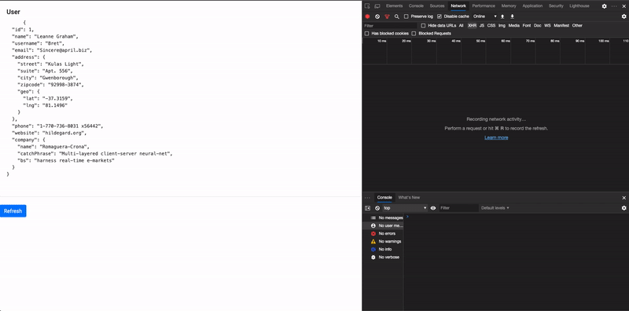

# @digikare/ngx-offline-interceptor

> Block your http request when you are offline to avoid error and display toast message when offline/online event is throw.




# 
- [Installation](#Installation)
- [Usage](#Usage)
    - [Custom Config](#Custom-Config)
   - [Using with translate module](#Using-with-translate-module)

#

## Installation


```
$ npm i --save @digikare/ngx-offline-interceptor
````

## Usage 
```typescript
@NgModule({
  declarations: [
    AppComponent
  ],
  imports: [
    ...
    NgxOfflineInterceptorModule.forRoot(),
    ...
  ],
  providers: [],
  bootstrap: [AppComponent]
})
export class AppModule { }
```

## Custom Config

```typescript
{
  loader?: Provider;
  displayToast?: boolean; // true
  contentOffline?: string; // You are offline
  contentBackOnline?: string; // You are now online
  toastDuration?: number; // 2000ms
}
```
```typescript
...
NgxOfflineInterceptorModule.forRoot({
    contentOffline : "❌ Offline ❌",
    contentBackOnline : "✅ back online",
}),

```

## Using with translate module

> Example with ngx-translate
```typescript
@NgModule({
  declarations: [
    AppComponent
  ],
  imports: [
    ...
    NgxOfflineInterceptorModule.forRoot(),
    ...
  ],
  providers: [
      {
      provide: APP_INITIALIZER,
      useFactory: appInitializerFn,
      multi: true,
      deps: [
        TranslateService,
        NgxOfflineInterceptorService
      ],
    },
  ],
  bootstrap: [AppComponent]
})
export class AppModule { }


const appInitializerFn = (
  translateService: TranslateService,
  offlineService: NgxOfflineInterceptorService,
) => {
  return () => {
      translateService.get([
          'OFFLINE.BACK_TO_ONLINE', //<YOUR_KEY_OFFLINE>
          'OFFLINE.OFFLINE'  //<YOUR_KEY_ONLINE>
        ]).subscribe((res) => {
          offlineService.setConfig({
            contentBackOnline: res['OFFLINE.BACK_TO_ONLINE'],
            contentOffline: res['OFFLINE.OFFLINE']
          });
        });
  }
};

```
